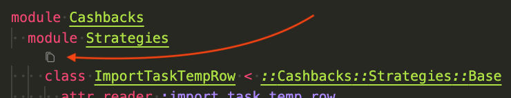
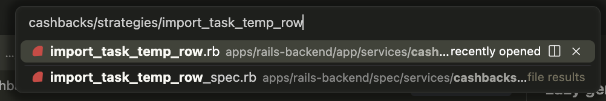

# Super Toolbelt (VSCode/Cursor)

## Features
- Inline copy hint on Ruby `class` lines that copies the fully qualified name.
- `cmd+p` / `ctrl+p` intercepts Quick Open and uses the clipboard if it contains a Ruby class name, formatting it to a searchable format.
  - `::MyModule::OtherModule::ClassName` becomes `my_module/other_module/class_name`




## Configuration
You can disable specific features in your settings:
```json
{
  "superToolbelt.enableRubyClassCopy": false,
  "superToolbelt.enableRubyQuickOpenFromClipboard": false
}
```

## Local QA
1. From the repo root, install deps:
   - `pnpm install`
2. Build the extension:
   - `pnpm run compile`
3. In VSCode/Cursor, use "Run Extension" to open an Extension Development Host.
4. Open any Ruby file (e.g. `app/services/...`):
   - Verify the inline `copy` hint shows on `class` lines.
   - Clicking the icon copies the full class name with modules.
5. Copy a full class name, then press `cmd+p`:
   - Example: `Reporting::Customers` -> Quick Open prefilled with `reporting/customers`.
   - If clipboard does not match the regex, Quick Open opens empty.

## Packaging and Installation
1. Package a VSIX:
   - `npx vsce package`
2. Install in VSCode/Cursor:
   - Command Palette: "Extensions: Install from VSIX..."
   - Or CLI: `cursor --install-extension ./super-toolbelt-0.0.1.vsix`

## Publishing
1. Update `publisher` in `package.json` to your Marketplace publisher ID.
2. Publish to the VSCode Marketplace:
   - `npx vsce publish`
3. Optional: publish to Open VSX for wider compatibility:
   - `npx ovsx publish`

## CI Publishing (OpenVSX)
Publishing to OpenVSX runs automatically on pushes to `main` via GitHub Actions.

Setup:
1. Create an OpenVSX publisher and access token.
2. Add a repository secret named `OPEN_VSX_TOKEN` with that token.

Notes:
- The workflow only runs on `push` to `main`, so PRs do not receive secrets.
